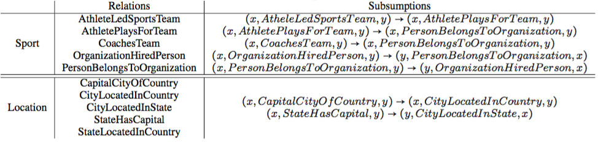
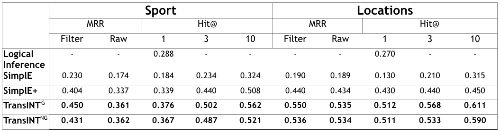
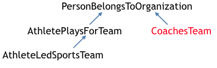

# TransINT
Repository for ICLR 2020 Submission "TransINT: Embedding Implication Rules in Knowledge Graphs with Isomorphic Intersections of Linear Subspaces"

## Prerequisites 
Please install Python 3.6 and Pytorch

## Model Performances for the NELL Location/ Sports Dataset
We ran additional experiments on NELL Location / Sports Dataset (created by \[1\]). This dataset consists of the following rules: 

(Taken from \[2\]'s Table 3.)

We compared results of TransINT$$^G$$ and TransINT$$^{NG}$$ with \[2\]. 

(Rows except for TransINT$$^G$$ and TransINT$$^{NG}$$ directly copied from \[2\].)

TransINT$$^G$$ and TransINT$$^{NG}$$ both outperform \[2\] on all metrics and settings (especially the first with a significant gap). 

\[1\]: Wang, Quan, Bin Wang, and Li Guo. "Knowledge base completion using embeddings and rules." Twenty-Fourth International Joint Conference on Artificial Intelligence. 2015.

\[2\]: Fatemi, Bahare, Siamak Ravanbakhsh, and David Poole. "Improved knowledge graph embedding using background taxonomic information." Proceedings of the AAAI Conference on Artificial Intelligence. Vol. 33. 2019.

<!---## How to assign ranks to "Skip Edges"
The rules in Nell Sports dataset are bind by the following implication rules: 


(Arrows are from a more specific relation to a more general (implied) relation;
Rank is the rank of the $$H_r$$ for each relation $$r$$ (total dimension is $$d$$)).

In this case, "CoachesTeam" can be considered as the same level as "AthletePlaysForTeam" or "AthleteLedSportsTeam"; in other words, should "CoachesTeam" be assigned rank? 

We expreimented with assigning "CoachesTeam" respectively the rank of "AthletePlaysForTeam" and "AthleteLedSportsTeam", and obtained the following results:

Not significant, but . 
Thus, it is advised to use ranks . -->

## How to Replicate Results

In order to replicate results, please first download the pre-processed data here: https://drive.google.com/file/d/1wBuG3zBkNe7L5i7S-eZBKx88VhTYeoHQ/view?usp=sharing
Unzip it and place the "dataset" folder right under "TransINTProject". 

### Results for Link Prediction on FB122
Run the following commands at the "TransINTProject" directory.
1. TransINT$$^G$$
```
python transINT_Bernoulli_pytorch.py  -l 0.003 -es 1000 -f 1 -n 1000 -em 100 -lr_decay 1  -c 0 -imp 1  -rank_file NULL_dim_100_hr_gap1_dict.p -d KALE/FB122/dim_100_hr_gap1_no_norm_ent_f1imp1   -norm_rel 0 -norm_ent 0 -norm_mat 0 -m 5  -L 1 -eval_cycle 10  -gray 1
```
(Optimal Configuration was - learning rate: 0.003, number of dimensions (d): 100, margin: 5, learning rate decay: 0.95, no normalization on entity vectors, relation vectors, and relation subspace bases, L1 (among L1 and L2 norms in calculating distances))

2. TransINT$$^{NG}$$
```
python transINT_Bernoulli_pytorch.py  -l 0.003 -es 1000 -f 1 -n 1000 -em 50 -lr_decay 0.95  -c 0 -imp 0  -rank_file NULL_dim_50_hr_gap1_dict.p -d KALE/FB122/dim_50_hr_gap1_no_norment_noimp  -gray 1  -norm_rel 0 -norm_ent 0 -norm_mat 0 -m 5  -L 1 -eval_cycle 10
```
(Optimal Configuration was : learning rate: 0.003, number of dimensions (d): 50, margin: 5, learning rate decay: 0.95, no normalization on entity vectors, relation vectors, and relation subspace bases, L1 (among L1 and L2 norms in calculating distances))

<!---### Results for Triple Classificaion on FB122
1. TransINT$^G$

(Optimal Configuration was :)

2. TransINT$^{NG}$
(Optimal Configuration was : ) -->


### Results for Link Prediction on NELL Sport
1. TransINT$$^G$$
```
python transINT_Bernoulli_pytorch.py  -l 0.003 -es 1000 -f 1 -n 1000 -em 100 -lr_decay 1  -c 0 -imp 1  -rank_file NULL_dim_100_hr_gap1_dict.p -d KALE/FB122/dim_100_hr_gap1_no_norm_ent_f1imp1   -norm_rel 0 -norm_ent 0 -norm_mat 0 -m 5  -L 1 -eval_cycle 10  -gray 1
```
(Optimal Configuration was - learning rate: 0.003, number of dimensions (d): 100, margin: 5, learning rate decay: 0.95, no normalization on entity vectors, relation vectors, and relation subspace bases, L1 (among L1 and L2 norms in calculating distances))

2. TransINT$$^{NG}$$
```
python transINT_Bernoulli_pytorch.py  -l 0.003 -es 1000 -f 1 -n 1000 -em 100 -lr_dey 0.95  -c 1 -imp 0  -rank_file three_2_NULL_dim_100_hr_gap1_dict.p -d KALE/Nell_sp/three_2_dim_100_hr_gap1_no_norment_no_normrel_imp0  -gray 1 -norm_rel 0 -norm_ent 0 -norm_mat 0 -m 5  -L 1 -which_dataset Nell_sp -eval_cycle 10
```
(Optimal Configuration was - learning rate: 0.003, number of dimensions (d): 100, margin: 5, learning rate decay: 0.95, no normalization on entity vectors, relation vectors, and relation subspace bases, L1 (among L1 and L2 norms in calculating distances))


### Results for Link Prediction on NELL Locations
1. TransINT$$^G$$
```
python transINT_Bernoulli_pytorch.py  -l 0.0075 -es 1000 -f 1 -n 1000 -em 50 -lr_decay 0.95  -c 1 -imp 1  -rank_file NULL_dim_50_hr_gap1_dict.p -d KALE/Nell_loc/dim_50_hr_gap1_no_norment_no_normrel_yes_imp  -gray 1 -norm_rel 0 -norm_ent 0 -norm_mat 0 -m 5  -L 1 -which_dataset Nell_loc -eval_cycle 10
```
(Optimal Configuration was - learning rate: 0.0075, number of dimensions (d): 50, margin: 5, learning rate decay: 0.95, no normalization on entity vectors, relation vectors, and relation subspace bases, L1 (among L1 and L2 norms in calculating distances))

2. TransINT$$^{NG}$$
```
python transINT_Bernoulli_pytorch.py  -l 0.001 -es 1000 -f 1 -n 1000 -em 50 -lr_decay 0.925  -c 1 -imp 0  -rank_file NULL_dim_50_hr_gap1_dict.p -d KALE/Nell_loc/dim_50_hr_gap1_no_norment_no_normrel  -gray 1 -norm_rel 0 -norm_ent 0 -norm_mat 0 -m 5  -L 1 -which_dataset Nell_loc -eval_cycle 10
```
(Optimal Configuration was - learning rate: 0.001, number of dimensions (d): 50, margin: 5, learning rate decay: 0.925, no normalization on entity vectors, relation vectors, and relation subspace bases, L1 (among L1 and L2 norms in calculating distances))


<script type="text/javascript" async

src="https://cdn.mathjax.org/mathjax/latest/MathJax.js?config=TeX-MML-AM_CHTML">
